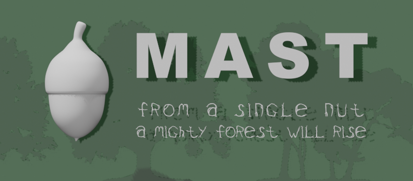

# What is {{ab.m}} 

{{ab.m}} (Multiple Agent Story Telling) is a programming language used in {{ab.ac}} to create Game Mastered and Story driven Missions. 

{{ab.m}} provides a new simple programming language that enables:

* Language that flows more like a narrative or film script
* Easy and rich GUIs for the pause scene and the {{ab.ac}} consoles
* A Task/State driven system managing multiple tasks in parallel e.g. a quest with side quests
* Complex AI 
* Interactive choices and dialog
* Similar capabilities to Visual Novel systems, such as RenPy, Inkle Ink, and Choice script

## Multiple Agent Story Telling


### Multiple Agents
The multiple agents of a {{ab.m}} story (players, non-player characters, etc.) each have their own story and those stories can have multiple side plots.

In {{ab.m}} for {{ab.ac}}, the multiple agents are the player consoles, the ships, various characters that can be on ships, etc. {{ab.ac}} has the ability to add many more characters to the game. For example there can be multiple characters on a space station that you may interact with. The Damage Control teams can have richer stories and each can be unique.


### Storytelling
Stories have a forward moving flow; there is a beginning, a middle and an end. {{ab.m}}'s programming flow keeps the story moving forward. {{ab.m}} also facilitates an interactive narrative which allows for choice and branching of the story, revisiting aspects of the story etc. while still flowing the story on a single path.

### Multiple stories
An {{ab.ac}} mission is not just one story about one thing; it is many. 

{{ab.sbs}} may be familiar with the ```<event>```. 

{{ab.ac}} has the concept of Task.

Tasks run a single script. From beginning to end.

Tasks run in (pseudo) parallel.
Unlike the Artemis: SBS events, Task can be scheduled, canceled, and can end.

Tasks are described in detail in the [{{ab.m}} Language](./overview.md) 


## Why a language other than python?
{{ab.ac}} engine allows for scripting missions using Python. Python is a productive and easy to learn programming language. To help script writers, the sbs_utils library was created. This is a powerful and viable option to create {{ab.ac}} scripts.

While working with several script writers familiar with the {{ab.sbs}} XML mission scripting some found the python daunting and far less productive. Many of these script writers are authors, educators and are not full time programmers. 

### Markup language vs. programming language
{{ab.m}} is a hybrid of a markup language and a programming language. 

[Markup languages](https://en.wikipedia.org/wiki/Markup_language) provide a simple text document that simplifies a more complex system.

Inspiration for {{ab.m}} are languages like [Inkle Ink](https://www.inklestudios.com/ink/), [choice script](https://www.choiceofgames.com/make-your-own-games/choicescript-intro/), [renPy](https://www.renpy.org/doc/html/language_basics.html).


### Reuse and add-ons
The {{ab.m}} system makes it easy to extend things and package these extensions to be shared by other missions.

For example, {{ab.ac}} ships with the Secret Meeting and Walk the Line missions. They appear very small, but they use code from Legendary Missions that are packages as mastlib addons (found in the \__lib__ folder)

As more scripts are written it should be easy to create a side mission as an add on and allow it to be dropped into many other missions to share.


### Hierarchical flow vs. Sequential flow
Early programming language like BASIC. Were approachable to hobbyist and non-programmer. The would run in a sequential flow from beginning to end in a simple script that was easier to follow. However, reuse and code organization was difficult to manage as project grew large and more complex.

Python and other object oriented languages tend to have a hierarchical execution flow with functions calling functions into a deep hierarchy of execution. 

### State and State machine
Games in general tend to manage the state of items in the world and respond to changes to change the state. 

Programmers often create a pattern called a [State Machine](https://en.wikipedia.org/wiki/Finite-state_machine) to deal with this.

The {{ab.sbs}} XML language was a markup 'language' that all it did was run multiple state machines. i.e. the ```<event>``` tags in are state machines. The state conditions are checked and if met the event runs.

The {{ab.sbs}} XML language is inefficient in that all events always, and it had no concept of reuse. Script writers copy and pasted events to 'reuse' them. 

Even in other programming languages State Machines require boiler plate code to add new states and transitions. This also requires copy and pasting code.

{{ab.m}} is intended to enabling creating state driven programming that:
- More efficient because only needed things are executed
- script writers do not write state machine and management code


